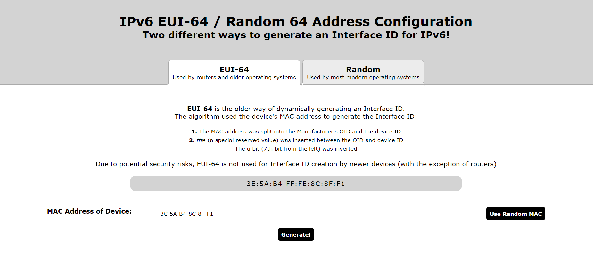

# Algorithm Practise: IPv6 EUI-64

__Live Version__ An interactive webpage can be found [here](https://de-mark.github.io/algorithm_ipv6-eui-64/)

## What is EUI-64?

In IPv6, hosts can use __SLAAC__ to generate unique, routable IPv6 addresses on their own. In order for a host to utilize SLAAC, it must generate a unique Interface ID. There are two main ways a host can generate a unique Interface ID: __EUI-64__ or __Randomly__.

<table>
    <thead>
        <tr>
            <th>
                Global Routing Prefix
            </th>
            <th>
                Subnet ID
            </th>
            <th>
                Interface ID
            </th>
        </tr>
    </thead>
    <tbody>
        <tr>
            <td>
                48 bits
            </td>
            <td>
                16 bits
            </td>
            <td>
                64 bits
            </td>
        </tr>
    </tbody>
</table>

Most older machines (and several routers) use __EUI-64 (Extended Unique Identifier)__ to generate their Interface IDs.

In __EUI-64__, the host takes its MAC address and splits it into two: __Manufacturer's OUI__ and __Device ID__. 

It then then inserts a reserved character--`fffe`--between the two.

Finally, it takes the seventh bit from the left--the __u bit__--and inverses it. 

Since it's easy to discern a device's MAC address from its EUI-64, there were several security concerns. Newer devices typically randomly generate their Interface ID. Furthermore, devices will have a temporary ID that it switched at several intervals to bolster privacy.

## Why Program it?

While studying, I had trouble wrapping my head around the creation of unique ids for IPv6, so I wanted to take the explanation and program an example for better understanding.

## How this program works:

Since the algorithm is simple enough (subsetting, translation into binary, and inversion), the program is written in JavaScript and hooked up to a webpage (located [here](https://de-mark.github.io/algorithm_ipv6-eui-64/)).

The website has two options: EUI-64 or Random Interface ID creation.

If you select EUI-64, you can either press the __Use Random MAC__ button to generate a random MAC (it cycles through several well known companies for the OUI) or you can enter a MAC of your choosing. You can use nearly any symbol for your delimiter.

If you select Random, it will randomly generate the Interface ID without considering a MAC address.